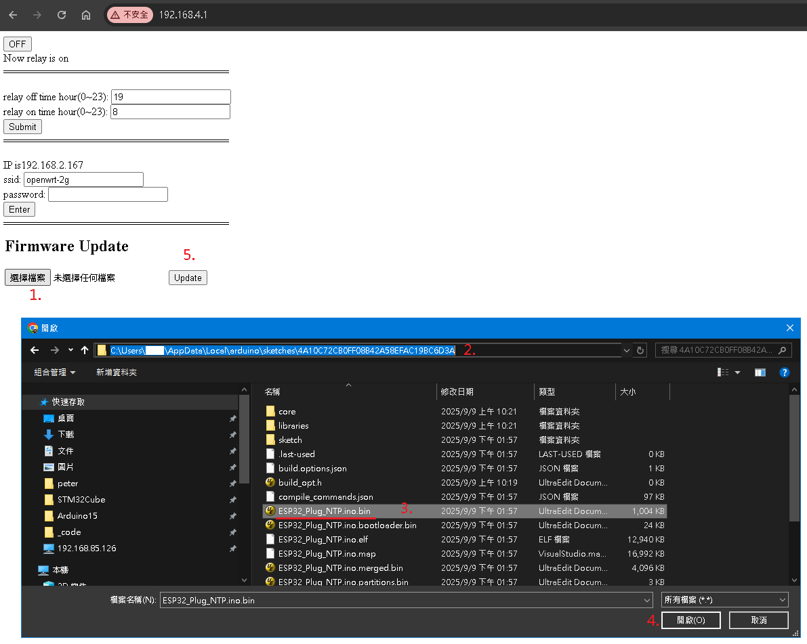

## Install Arduino IDE 2.3.6
[link](https://www.arduino.cc/en/software/)  

## Add esp32 Board
1. File -> Preferences -> Additional boards manager URLs -> `https://espressif.github.io/arduino-esp32/package_esp32_index.json`  
2. Boards manager -> search `esp32` by espressif systems -> install  
3. Select board `DOIT ESP32 DEVKIT V1`  
4. Verify then Upload  
5. connect to esp32 wifi AP `iot_plug`, then open `192.168.4.1` by chrome.  
6. on esp32 webpage, config esp32 to connect your wifi AP.  

## web page to config relay time, ssid, fw update
  
