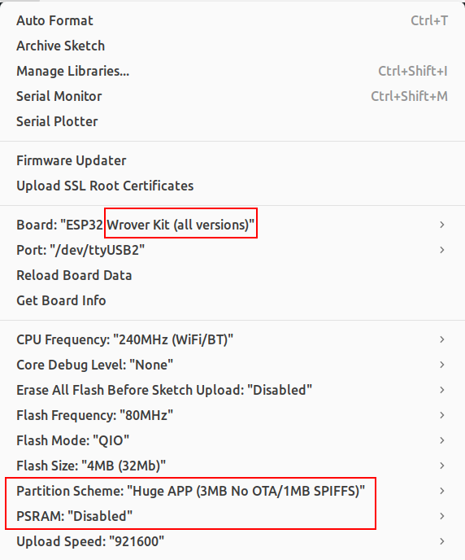
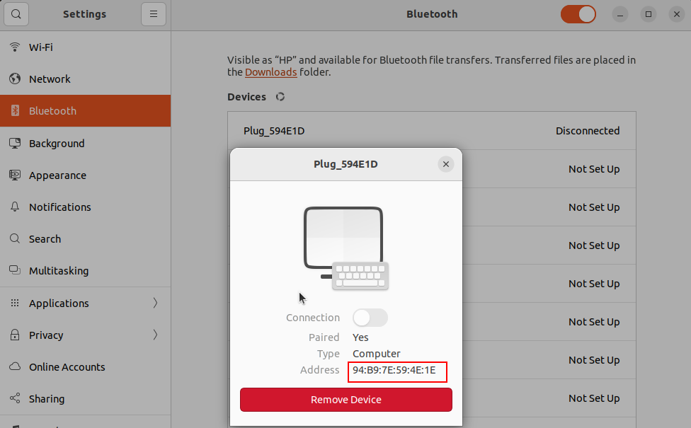
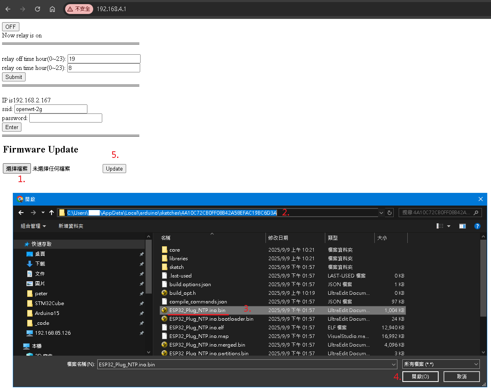

## Install Arduino IDE 2.3.6
[link](https://www.arduino.cc/en/software/)  

## Add esp32 Board
1. File -> Preferences -> Additional boards manager URLs -> `https://espressif.github.io/arduino-esp32/package_esp32_index.json`  
2. Boards manager -> search `esp32` by espressif systems -> install  
3. Select board `ESP32 Wrover Kit (all versions)`  
4. Set partition to `Huge App` and PSRAM to `Disabled`  
  

5. Verify then Upload  
6. win10 connect to esp32 wifi AP `PLUG_XXXXXXXXXXXX`, then open `192.168.4.1` by chrome. (esp32 AP mode).  
7. on esp32 webpage, enter ssid to connect another wifi AP. Esp32 will auto reboot and show new ip `192.168.2.167`. (esp32 STA mode).  
8. You can use BT SPP to get IP address.  
  
```
sudo rfcomm bind rfcomm0 94:B9:7E:59:4E:1E 1  
sudo picocom -b 115200 /dev/rfcomm0  
// press enter to print IP address  

// unbind  
sudo rfcomm unbind rfcomm0  
```

## web page to config relay time, ssid, fw update
  
